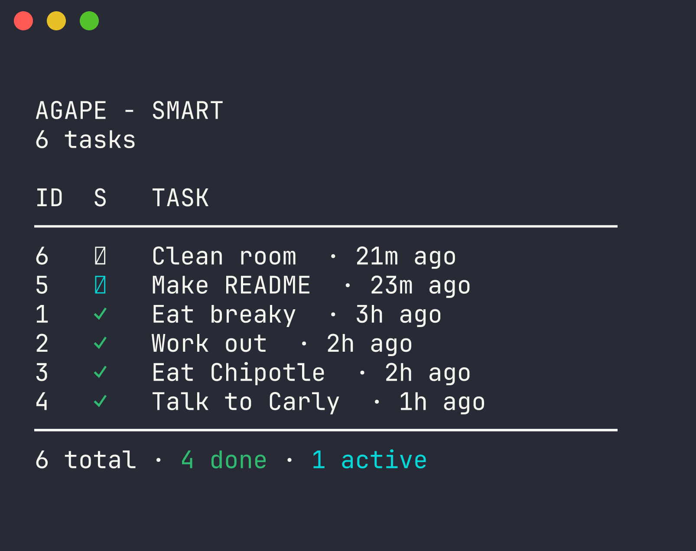

# AGAPE


**An elegant, hand-crafted task manager for the command line.**

AGAPE is a thoughtfully designed CLI tool that treats task management with care. Every detail—from spacing and typography to ranking logic and safety nets—is intentional. The goal is simple: make interacting with your tasks feel calm, obvious, and humane.

<p align="left">
  
</p>

---

## ✨ What Makes AGAPE Different

Most task CLIs optimize for feature lists. AGAPE optimizes for *experience*.

- **Beautiful default output** — clean hierarchy, consistent spacing, no clutter
- **Smart task ranking** — urgency-aware ordering that surfaces what matters now
- **Human time & dates** — “2h ago”, “tomorrow at 5pm”, never raw timestamps
- **Undo by default** — destructive actions are always reversible
- **Hand-crafted, restrained UI** — no gimmicks, no noise, no wasted motion

AGAPE is designed so that a screenshot of its output *stands on its own*.

---

## 📸 Example Output

```text
AGAPE - SMART
4 tasks

ID  S   TASK
────────────────────────────────────────
1   ✓   Eat breaky · 2h ago
2   ✓   Work out · 1h ago
3   ✓   Eat Chipotle · 1h ago
4   ✓   Talk to Carly · 47m ago
────────────────────────────────────────
4 total · 4 done
```
---

## 🚀 Installation

Clone the repository and install dependencies:

```bash
git clone https://github.com/josequiceno2000/agape.git
cd agape
pip install -r requirements.txt
```

Make the CLI globally available:

```bash
chmod +x agape
sudo mv agape /usr/local/bin/
```

You can now run:

```bash
agape --help
```

---

## 🧠 Core Commands

### Add a task

```bash
agape add "Write README"
agape add "Submit assignment" --due "tomorrow at 11pm"
```

Natural language due dates are supported out of the box.

---

### List tasks

```bash
agape list          # default view
agape list --smart  # urgency-ranked view
agape list --done   # filter by status
```

Smart mode ranks tasks using urgency, due dates, status, and recency.

---

### Update a task

```bash
agape update 2 "Prepare interview notes"
```

---

### Mark task status

```bash
agape mark 3 --progress
agape mark 3 --done
```

---

### Delete tasks (with safety)

```bash
agape delete 1
dagape delete --all
```

All destructive actions create an automatic backup.

---

### Undo

```bash
agape undo
```

Instantly reverts the most recent destructive operation.

---

## 🎨 Design Philosophy

AGAPE follows a few strict principles:

- **Hierarchy over color** — layout communicates meaning before styling
- **Defaults matter most** — flags refine behavior, not rescue it
- **Humans first** — relative time, calm messages, forgiving UX
- **Machines respected** — predictable output, clean separation of concerns

The UI logic lives in `theme.py`, fully isolated from business logic in `logic.py`.

---

## 🧪 Testing

AGAPE includes a growing pytest suite:

```bash
pytest
```

Tests focus on correctness, safety, and CLI behavior.

---

## 📁 Project Structure

```text
agape/
├── agape               # CLI entrypoint
├── src/
│   ├── logic.py        # Core task operations
│   └── theme.py        # Output formatting & UI system
├── tests/              # Pytest suite
├── tasks.json          # Local task storage
├── tasks.json.bak      # Automatic backup
└── README.md
```

---

## 🔒 Data & Privacy

- All data is stored locally in `tasks.json`
- No network calls
- No telemetry
- No tracking

Your tasks are yours.

---

## 🛠️ Built With

- Python 3.12
- argparse
- dateparser
- pytest

---

## 📜 License

MIT License. See `LICENSE` for details.

---

## ✍️ Author

**Jose Quiceno**

Built with care and respect for the command line.

If you appreciate tools that value clarity over cleverness, AGAPE is for you.

